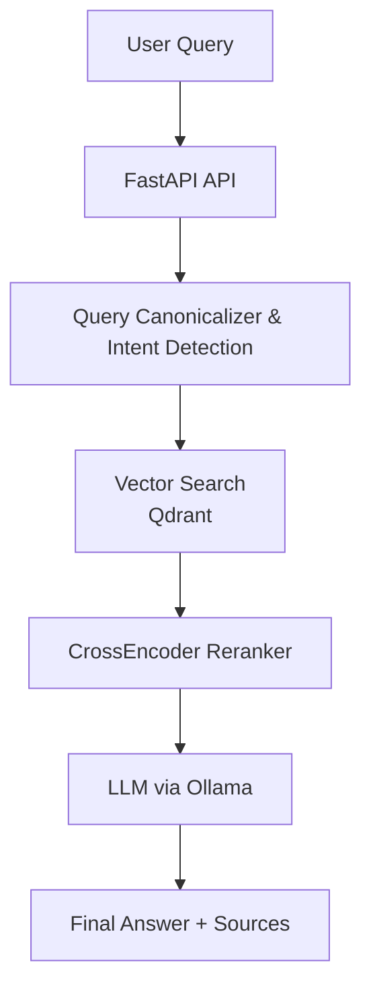

# RAG Knowledge Base Assistant

A production-style Retrieval‑Augmented Generation (RAG) backend for question answering over a document knowledge base.  
It combines a FastAPI service, Qdrant vector search, local LLM inference via Ollama, and a document ingestion pipeline, with an optional Streamlit UI for quick testing.

---

## Quick demo

```bash
curl -X POST http://localhost:9004/ask \
  -H "Content-Type: application/json" \
  -d '{"question": "How do I create a new payment request?"}'
```

The API returns a structured JSON answer with sources and confidence scores.

---

## Key features

- **RAG question answering** over a local document knowledge base
- **Vector search** with Qdrant and dense embeddings
- **Local LLM inference** via Ollama (chat + optional vision model)
- **Ingestion pipeline** for converting, chunking, and indexing documents
- **Reranking / embeddings** using `sentence-transformers` and PyTorch
- **FastAPI backend** with JSON API endpoints (`/ask`, `/clarify`, `/health`, `/entities`)
- **Lightweight Streamlit UI** for interactive testing (not the primary focus)
- **Docker / Docker Compose** setup targeting Linux environments

---

## Architecture

```text
User Query
  -> FastAPI API (api.py)
    -> Query canonicalizer & intent classifier
    -> Entity resolver (abbreviations, concepts)
    -> Vector search in Qdrant (app/search_engine.py)
    -> Reranker (sentence-transformers CrossEncoder)
    -> Answer builder (LLM via Ollama)
  -> Structured Answer
       - answer text
       - sources (docs / sections)
       - debug info (scores, entities, intent)
```

## Architecture overview



---

## Tech stack

- **Backend**: Python 3, FastAPI, Uvicorn  
- **Retrieval**: Qdrant, `sentence-transformers`, `scikit-learn`, `numpy`  
- **LLM / Inference**: Ollama, PyTorch, Transformers  
- **Ingestion**: Docling, LangChain text splitters  
- **Infra / Tooling**: Docker, Docker Compose, Linux, Streamlit (optional testing UI)

---

## Repository structure

```text
.
├─ api.py                 # FastAPI entrypoint (RAG API)
├─ main.py                # Simple console client for local testing
├─ ingest.py              # SmartIngestor: documents → chunks → Qdrant
├─ ui.py                  # Optional Streamlit chat UI
├─ config.py              # Core configuration (models, thresholds, prompts)
├─ app/
│  ├─ config.py           # App-level settings (retrieval, prompts)
│  ├─ search_engine.py    # Qdrant integration and vector search
│  ├─ embedder.py         # Shared embedding model (singleton)
│  ├─ reranker.py         # CrossEncoder reranker
│  ├─ canonicalizer.py    # Query normalisation / pattern detection
│  ├─ intent.py           # Rule-based intent classifier
│  ├─ entity_registry.py  # Entity extraction + clustering
│  ├─ entity_resolver.py  # Abbreviation / entity resolution
│  ├─ disambiguator.py    # Deterministic clarification logic
│  ├─ response_builder.py # LLM call + structured answer assembly
│  ├─ source_resolver.py  # Maps chunks back to documents / links
│  └─ vision.py           # Optional screenshot analysis via Ollama vision
├─ Dockerfile
├─ compose.dev.yaml
├─ compose.prod.yaml
├─ requirements.txt
├─ data/                  # (gitignored) source documents
└─ storage/               # (gitignored) Qdrant DB, registries, catalogs
```

---

## How it works

- **Ingestion / preprocessing**
  - `ingest.py` walks the `data/` directory and uses Docling to convert documents (PDF, DOCX, etc.) to structured Markdown.
  - Optionally analyses embedded screenshots via a vision model (Ollama), appending `[SCREENSHOT: ...]` descriptions.

- **Chunking / embeddings**
  - Markdown is split hierarchically (by headers) and then into overlapping chunks.
  - Each chunk is “enriched” with document / section metadata and sent through a shared `SentenceTransformer` to produce dense embeddings.

- **Indexing**
  - Chunks are stored in Qdrant (`knowledge_base` collection) with payload metadata (source, category, entity_ids, etc.).

- **Retrieval + reranking**
  - On `/ask`, the query is canonicalised, intent is detected, and abbreviations/entities are processed.
  - A first‑stage vector search pulls candidates from Qdrant.
  - A CrossEncoder reranker scores candidates; low‑score or multi‑topic cases can trigger deterministic clarification.

- **Answer generation**
  - Top reranked chunks are passed (with clear prompts) to a local LLM via Ollama.
  - `response_builder.py` assembles a structured JSON answer: text, sources, confidence, and debug info.

---

## Running locally

### 1. With Docker / Docker Compose (recommended)

Prerequisites:

- Docker and Docker Compose installed
- Ollama running on the host (e.g. `ollama serve`)
- Required models pulled in Ollama, for example:
  ```bash
  ollama pull qwen3:14b
  # optional vision model if you use screenshot analysis
  ollama pull qwen3-vl:8b
  ```

Quick start (dev):

```bash
# from repository root
docker compose -f compose.yaml -f compose.dev.yaml up --build
```

This starts:

- **API** on `http://localhost:9004`
- **Streamlit UI** on `http://localhost:9003` (proxying requests to the API)

### 2. Bare metal (Python, without Docker)

Prerequisites:

- Python 3 + virtualenv
- Qdrant (embedded, no external service needed)
- Ollama running locally

```bash
python -m venv .venv
source .venv/bin/activate
pip install -r requirements.txt

# Ingest documents (assumes your docs in ./data/)
python ingest.py

# Run API
python api.py  # exposes FastAPI on 0.0.0.0:9004 by default

# (Optional) Run Streamlit UI
streamlit run ui.py --server.port=9003 --server.address=0.0.0.0
```

---

## Example usage

### REST API request

```bash
curl -X POST http://localhost:9004/ask \
  -H "Content-Type: application/json" \
  -d '{"question": "How do I create a new payment request?"}'
```

Example JSON response shape:

```json
{
  "needs_clarification": false,
  "answer": "To create a new payment request, open the Payments section, select \"Create request\", fill in the payer, recipient, amount and due date, then save and submit for approval.",
  "sources": [
    {
      "id": "a1b2c3d4e5f6",
      "name": "payments_guide.pdf",
      "link": "/docs/payments_guide.pdf",
      "category": "finance"
    }
  ],
  "context": "... concatenated, filtered chunks used for the answer ...",
  "debug": {
    "canonical_query": "create payment request",
    "intent": "instruction",
    "confidence": 0.88,
    "top_score": 0.73,
    "entity_ids": ["payment_request"],
    "sources_count": 3
  }
}
```

---

## Why this project is interesting

- **Backend‑centric**: focuses on FastAPI, vector search, ingestion, and LLM integration rather than UI.
- **Full RAG stack**: ingestion → embeddings → Qdrant retrieval → CrossEncoder reranking → LLM answer generation.
- **Self‑hosted / local models**: uses Ollama for running models locally, suitable for on‑prem or privacy‑sensitive setups.
- **Structured assistant**: exposes clean JSON APIs and structured source information, making it easy to integrate into other services.

---

## Future improvements

- **Authentication / multi‑tenant access control** for the API and UI.
- **Observability**: request tracing, metrics, and better logging around retrieval / reranking.
- **Evaluation harness**: automated regression tests on a small, synthetic eval set.
- **Ingestion hardening**: better handling of large / heterogeneous document sets and incremental updates.
- **Production deployment**: CI/CD, blue‑green deployments, and resource‑aware scaling strategies.

